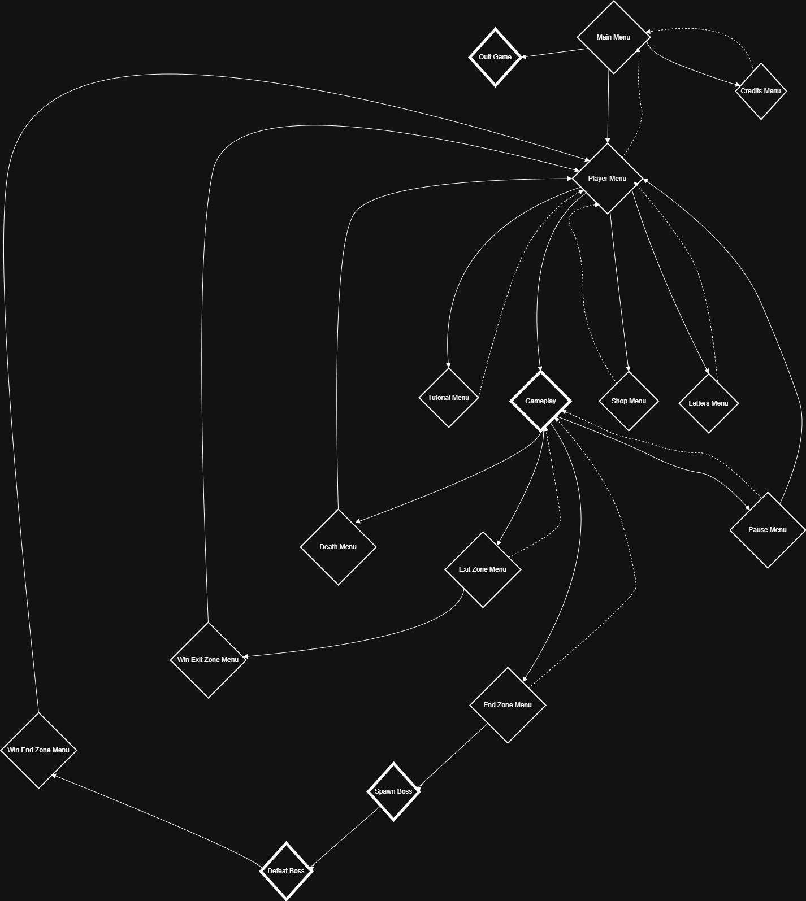

# **The Story of Abyssborne**
---

# **Motivation**

I have loved games since I was a child, and this year, I had the opportunity to channel that passion into a university project that turned into a full-fledged playable game: *Abyssborne*. At first, it was my first contact with **Unreal Engine 5**, Blueprints, and all the tools that come with it. As I learned more and gained confidence with UE5, my initial project grew into a passion. 

I made a full plan for this game, aiming to deliver a great single-player experience with the complete package: game mechanics, animations, VFX, audio, menus, enemies, environment, lighting, shadows, AI, balance changes, testing, and more. Essentially, I wanted to include as much as I could to create an enjoyable and cohesive experience for players.

Step by step, I made more changes and updates, constantly thinking about how to make the game more enjoyable. I asked myself: "What can I do more? How? Why?" These are the thoughts that run through every game developer's mind. 

It wasn’t always easy being a one-person team. This project was designed as a solo endeavor for university, and through it, I learned to appreciate the power of collaboration in game development. No one, not even me, can excel in every department required for a game. Still, I thoroughly enjoyed the process, and here we are with a solid first game of mine. 

I hope you enjoy reading this documentation about how the game came to life. A quick note: there will be spoilers ahead. Additionally, no code will be discussed in this documentation. The code is well-documented in the editor, with plenty of comments and notes. If you want to explore the code, you can find it in the repository. 

Here, we will discuss the journey of making *Abyssborne* and how everything works, from a more technical perspective. If you’re a player reading this, maybe leave this for now, enjoy the game, and come back later—the game was designed to explain everything you need to know to play. 

Let’s get to the next chapter in this story!

# **The Starting Point**

So, my first thoughts on finding an idea for this game were like this: I love story-driven games. My favorite game series is **God of War**, and you can clearly see the influence of that here. However, if I wanted to make something like "the next God of War," it would mean I needed to be an exceptional artist to create the stunning environments that games like these excel in. But I am no artist. Attempting a story-driven game with varied levels, each requiring unique artistic visions, models, and meshes, would have been a suicide mission given my time, resources, and experience.

### Finding a Feasible Path

I knew I needed to find something else. My next thought was that I wanted to create an **enjoyable game**. With those two initial thoughts in mind, a third idea came shortly after: I needed to make a game with an **engaging loop** that was feasible to develop within my limited constraints. I wanted something that didn’t rely heavily on visuals but instead focused on **game design and replayability**.

This led me to the concept of a **procedural dungeon with rooms**. Why?
- The action happens inside the dungeon, so no need for vast, visually stunning environments like mountains or mystical forests.
- Procedural generation means replayability—a new dungeon every run, creating an **infinite replayable experience**.

### Inspirations

I started thinking about games I’ve played that use similar ideas. Two games stood out to me:
1. **God of War: Ragnarok - Valhalla DLC**
2. **Returnal**

Both are AAA games, but their **design philosophies** inspired me deeply. Let’s talk more about **God of War: Ragnarok - Valhalla DLC**, as it was the main influence.

### What Valhalla DLC Does Well

- **Roguelike Mechanics:**
  - You enter a level that is **randomly generated**, featuring temporary upgrades that enhance your performance. These upgrades **don’t carry over** to the next level, but certain currencies do, enabling **permanent upgrades**.
  - This balance of temporary boosts and long-term progression makes each run feel meaningful.

- **Story Integration:**
  - Even though it’s a roguelike, it intertwines story elements beautifully. Each run feels like a step toward something greater, keeping players invested in the **narrative** while enjoying the core gameplay.

- **Replayability:**
  - It has a **starting point** and an **end point**, but after reaching the end, the game’s core mechanics still offer infinite replayability.

If you want to learn more about **God of War: Ragnarok - Valhalla**, here is an article made by the developers:

[Valhalla Reinvented: Designing a Roguelite in God of War Ragnarok](https://sms.playstation.com/stories/valhalla-reinvented-designing-a-roguelite-in-god-of-war-ragnarok)


### Defining My Project Goals

With these inspirations and ideas in mind, I knew exactly what I wanted from my project:
1. **A procedural dungeon crawler** for replayability.
2. **An engaging gameplay loop** with upgrades and progression mechanics.
3. **A subtle, cryptic story** that unfolds through gameplay but doesn’t overshadow the core mechanics.
4. **Infinite replayability**, even after finishing the main story.

### Supporting Documents

For more details and related documents, refer to the [The Starting Point Folder](../The%20Starting%20Point/) in the repository. It contains:

1. **Document in Romanian (Raw):** [Initial Design Notes and Ideas](../The%20Starting%20Point/code_name_abyss.pdf)
2. **Document in English (Translated):** [Initial Design Notes and Ideas](../The%20Starting%20Point/code_name_abyss.ro.en.pdf)

You can also check the [Requirements Folder](../../Requirements/) in the repository. It contains the initial requirements for the university project:

1. **Document in Romanian (Raw):** [Planification and Requirements](../../Requirements/Planificarea%20si%20cerintele%20proiectului.pdf)
2. **Document in English (Translated):** [Planification and Requirements](../../Requirements/Planification%20and%20project%20requirements.pdf)

With this foundation, I was ready to move forward. Let’s explore how these ideas shaped *Abyssborne* in the next chapter!

# **The Actual Start**

So, now with a well-enough planned plan, it was time to start the actual project. *(I say "well enough" because you can’t have everything planned out from the start. Things change along the way. Yes, a vision, a principal plan, can exist from the beginning, but some things evolve across the road—new ideas emerge, etc. If someone tells you they made a plan from the beginning, had everything paved from start to finish, and nothing changed, they’re lying to you.)*

### Beginning the Journey

As I had no prior experience with UE5, I needed to search the internet for resources and understand how Blueprints work. While it wasn’t overly difficult for me, thanks to my programming background and familiarity with many programming concepts, I understand that for others, it could be more challenging.

My first stop was **YouTube**, where I searched, "how to make a procedural dungeon generation in UE5." That’s when I stumbled upon a gem hidden in the dust. I found this guy: [REE-Animation](https://www.youtube.com/@REE-Animation), who had a playlist that was exactly what I needed: ["How To Create Epic Procedural Dungeons In Unreal Engine 5"](https://www.youtube.com/playlist?list=PLrZV1-GZa3Ds1-ON_oeWIdLHXCJ1QZH1P).

I can’t express how happy I was to discover this 5-video series. The tutorial was very well-made, and I learned so much for the journey ahead. I want to give a massive shoutout to **REE-Animation** and this great tutorial, which served as a huge starting point for my project. My motivation skyrocketed knowing I had such excellent help tailored precisely to what I needed.

### Utilizing Online Resources

The internet is vast and filled with resources. While I prefer watching **YouTube tutorials**, throughout this project, I explored:
- The official UE5 documentation
- Epic Games/UE5 forums
- Reddit
- StackOverflow
- Various articles and blog posts

There are resources for almost anything online (okay, not literally everything, but for the most part). With persistence, you can learn so much. This knowledge doesn’t just solve immediate problems but also helps you figure out new ones and come up with creative solutions later. You also gain new ideas as you internalize the concepts you’ve learned.

### Adapting the Tutorial

I created a new project and followed REE-Animation’s tutorial while putting my own fingerprint on it. I adapted and changed things to suit my preferences and, from time to time, sought other tutorials for specific aspects I wanted. I didn’t follow the tutorial step-by-step like a bot.

What makes this tutorial so brilliant is that it teaches key concepts while leaving gaps for you to fill in on your own. For example:
- **Elevator Room:** The tutorial creates a room for an elevator but doesn’t implement a working elevator, encouraging you to seek other tutorials.
- **AI System:** The tutorial builds a basic roaming AI that can follow the player but doesn’t implement damage or a full combat system, again prompting you to explore other resources.

These gaps allow you to take ownership of your project, which is essential for learning and creativity.

### Final Thoughts

Through this tutorial and the journey that followed, I learned that **everything is possible**. If you’ve made it this far in this documentation, know that you, too, can achieve whatever you put your mind to. This was my real starting point, and it paved the way for everything that followed.

Next, we’ll dive deeper into the **procedural dungeon system** and how it works.

# **Procedural Dungeon System**

### Note Before We Start
This section and the upcoming ones won’t have many photos or videos. For that, check out the [Development Photos and Videos](#development-photos-and-videos) section.

---

### How the Procedural Dungeon System Works

The procedural dungeon system is a core mechanic in *Abyssborne*. Here’s an in-depth explanation of how it generates dungeons, manages rules, and ensures a balanced gameplay experience.

1. **Starting Room**
   - The dungeon generation begins with a "Starting Room" placed at coordinates (0, 0, 0).
   - This room includes 3 exit points (green arrows), which are added to a **big exit list**.

2. **Room Placement**
   - A new room (from a pool of 5 base rooms) is spawned at a random exit point from the big exit list.
   - The new room’s exit points are added to the big exit list.
   - Overlap Check:
     - Each room has an overlap box. If a room overlaps another, the system tries a different exit point.
     - If no valid placement is found (extremely rare), the system uses a **timer system**. If the dungeon is not built within 120 seconds, the map is deleted, and a new dungeon is generated from scratch.

3. **Randomness Control**
   - A **seed system with streams** allows controlled randomness. Developers can input a specific seed to regenerate a known map, useful for debugging or saving favorite maps.
   - This feature is for development but could have future gameplay implications, such as saving favorite maps or creating a story mode with curated maps.

4. **Boss Room**
   - Once all rooms are spawned, the system places a **Boss Room**. It follows the same overlap and placement rules as other rooms.

5. **Spawn Points**
   - Each room has predefined spawn points for collectibles (coins, chests, potions) and enemies.
   - A **big spawn point list** is created during map generation.

6. **Collectible and Interaction Rules**
   - Collectibles and interactions are spawned based on dungeon size (randomly chosen between 15 and 45 rooms). The spawn rules are:
     - **Coins:** 4x number of rooms
     - **Enemies:** Equal to the number of rooms
     - **Chests:** Half the number of rooms
     - **Health Potions:** Equal to the number of rooms
     - **Mana Potions:** Equal to the number of rooms
     - **Dash Ability Potions:** Equal to the number of rooms
     - **Exit Zone:** Always 1
   - If there aren’t enough spawn points for all collectibles, the map is deleted, and a new one is generated.

7. **Special Rooms**
   - Every 3 rooms, a special room is spawned, chosen randomly from:
     - Elevator Room
     - Parkour Room
     - Stairs Room
     - Corridor Room
   - These rooms allow for multi-floor dungeons. With luck, a dungeon can have up to **15 floors**!

8. **Final Steps**
   - **Closing Exits:** Any unused exits are sealed with walls.
   - **Doors:**
     - **Light Doors:** Indicate whether the player has entered the room (red = unexplored, green = explored).
     - **Metal Doors:** Standard doors with no indicators.
     - **None Doors:** Gaps between rooms without doors.
   - **Spawning Collectibles and Interactions:** Coins, chests, potions, enemies, and the exit zone are placed at random valid spawn points.

9. **Player Spawn**
   - Once the dungeon is fully generated, a boolean signals the system, allowing the player to spawn.
   - During generation, the camera acts as a loading screen, showing the dungeon being built in real-time.

---

### What’s Next
The next section will cover **Environment**, discussing map design, the day and night cycle, and room design choices.

# **Environment**

### Art Style

The art style of the environment is dark and foreboding, as a dungeon should be. The textures used for the rooms are simple yet effective in creating an immersive dungeon atmosphere.

- **Doors:**
  - The doors have a bone skeleton texture or a metallic dungeon finish.
  - Practical Features:
    - **Red Lights:** Indicate unexplored rooms.
    - **Green Lights:** Indicate explored rooms.
    - These light indicators help players orient themselves within the maze-like dungeon.
  - **Mechanics:**
    - Doors feature an overlap box. When the player enters the box, the door opens (goes down). Once the player exits the overlap box, the door closes (goes up).
    - Doors work for enemies as well, allowing them to roam the dungeon freely, but the lights don’t change for enemies.

### Lighting and Atmosphere

- **Torches:**
  - Torches serve dual purposes:
    1. Provide light sources in otherwise dark environments.
    2. Enhance the dungeon aesthetic.
  - Decorative torches are strategically placed in corridor and parkour rooms.
  - Torches include:
    - **Smoke Effects**
    - **Flame Effects**
  - These elements significantly contribute to the dungeon’s atmosphere.

### Open Roof Design

The absence of a roof was an intentional design choice to accomplish two key objectives:

1. **Day and Night Cycle:**
   - Every 2–3 minutes, the environment transitions gradually between day and night.
   - While this has no direct gameplay impact (e.g., increased damage at night), it allows players to use the environment strategically.
   - **Maze Navigation:**
     - The dungeons are maze-like and lack a minimap or tracking device by design.
     - Players can use the sky—the sun, stars, or orientation of celestial bodies—to determine cardinal directions (N, S, E, W).

2. **Multi-Floor Visibility:**
   - The high walls enable a clear view of "towers" generated by multi-floor rooms.
   - Players can use these towers as visual landmarks to orient themselves, estimate distances, or determine how far they’ve strayed from notable points.

### Environmental Design Integration

Every aspect of the gameplay and interactions is crafted to align with the dungeon’s theme:

- **Coins:** Designed to complement the dungeon feel.
- **Potions, Chests, Exit Zones, and Boss Spawns:** Seamlessly blend with the environment while maintaining functionality.

---

The environment was built with great care to deliver both an immersive dungeon atmosphere and intuitive gameplay mechanics. In the next section, we will discuss the **Main Hero Character** in depth.

# **Main Hero Character**

### Concept and Design

The main character in *Abyssborne* is designed to be "anonym." This is why the character appears as a dark, hooded figure with no distinct face or name mentioned throughout the game. The intent was to make the player feel like they were transported into the Abyssborne realm, becoming a vessel themselves.

From a story perspective, the character is purposefully kept simple and anonymous to allow players to project themselves into the role and focus on the immersive experience.

### Tools and Resources

- **3D Model:**
  - The character model was sourced from **Sketchfab** ([Visit Sketchfab](https://sketchfab.com/feed)).
  - Both the sword and the magic orb were also found on Sketchfab.

- **Animations:**
  - Animations were created using **Mixamo** ([Visit Mixamo](https://www.mixamo.com/#/)).

### Development Process

1. **Character Import and Skeleton Creation:**
   - The character model was imported into Unreal Engine, and a skeleton was created using Mixamo.

2. **Basic Animations:**
   - A set of fundamental animations were added to the character:
     - **Walk**
     - **Run** (with sprint functionality via holding Shift)
     - **Jump**
     - **Fall**
     - **Idle**
     - **Sword Attack**
     - **Magic Orb Attack**
     - **Death Animation**

3. **Weapon Integration:**
   - The character wields a sword in one hand and a magic orb in the other.
   - **Sockets** were added to the character's skeleton to facilitate later combat mechanics and interactions.

The design of the main hero character lays a strong foundation for the combat and gameplay mechanics in *Abyssborne*. Next, we will dive into the **Enemies** section, exploring how they interact with the player and their role in the game.

# **Enemies**

### Skeleton

The Skeleton is the basic enemy of the Abyssborne realm. It was created using **Mixamo** and **Sketchfab** and serves as a simple yet effective undead adversary. Its design aligns with the dark dungeon aesthetic, featuring:

- **Appearance:**
  - A skeleton model wielding a skeleton sword (different from the player’s weapon).

- **Animations:**
  - Walk
  - Run
  - Idle
  - Attack
  - Getting Hit (stunned)
  - Death

- **Gameplay Mechanics:**
  - **Random Stats:** Each Skeleton has:
    - Health: Randomly between **50 and 300**.
    - Attack Damage: Randomly between **5 and 30**.
  - **Stunning Mechanic:** Can be stunned for 5 seconds when hit by the player’s ranged attack.
  - **Movement:** Slower than the player, allowing the player to escape by running.
  - **Vision:** Peripheral angle of **80 degrees**, making it less perceptive.

### Boss

The Boss is the strongest enemy in the game, encountered only when spawn conditions are met, and the Boss Room is found. It was also created using **Mixamo** and **Sketchfab**, designed to be visually and mechanically imposing.

- **Appearance:**
  - A demon-like model wielding a spear with a longer melee range than the player’s sword.

- **Animations:**
  - Walk
  - Run
  - Idle
  - Attack
  - Death

- **Gameplay Mechanics:**
  - **Random Stats:** Each Boss has:
    - Health: Randomly between **300 and 1000**.
    - Attack Damage: Randomly between **30 and 100**.
  - **Special Abilities:**
    - Cannot be stunned.
    - No "getting hit" animation (attacks cannot be interrupted).
    - **Self-Healing:** Regenerates a random amount of health (1–10) with each attack.
  - **Movement:** Medium speed, requiring the player to use dash to escape effectively.
  - **Vision:** Peripheral angle of **90 degrees**, making it more perceptive than Skeletons.

### NavMesh Walking

**NavMesh** is essential for enemy AI to navigate the dungeon. It dynamically adjusts to the dungeon layout, molding itself to valid walkable surfaces:

- **Dynamic NavMesh Box:** Automatically adapts to the generated dungeon structure and floor.
- **Limitations:**
  - NavMesh doesn’t work on stairs or parkour elements (potential improvement for future updates).

Both Skeletons and Bosses use the same NavMesh settings for navigation.

### AI Roam and Player Sensing

Both enemies follow similar AI behaviors:

1. **Roaming:**
   - When the player is not in sight, enemies roam randomly to a reachable location within a predefined radius.

2. **Sensing the Player:**
   - If the player enters their peripheral vision, the enemy moves toward the player.
   - Once close enough, the enemy attacks.

---

The enemies were designed to offer distinct challenges while maintaining the dungeon's immersive atmosphere. The next section will cover the **Combat System** for both the main character and enemies.

# **Combat System**

### The Philosophy Behind Combat

Creating a combat system is challenging because it needs to strike the right balance: the player should feel powerful but not invincible, and enemies should feel challenging but not unfair. I believe I succeeded in creating an enjoyable and balanced combat system for *Abyssborne*. Let’s dive into how it works.

### Player Combat Mechanics

The player has two main attacks:
1. **Melee Sword Slash:**
   - Short-range attack.
   - Consumes no mana.
   - Base damage: **10**.
2. **Magic Ranged Attack:**
   - Long-range, more powerful attack.
   - Consumes **20 mana**.
   - Base damage: **50**.
   - Stuns Skeleton Enemy for **5** seconds

### Starting Stats

At the beginning of the game, the player’s stats are:
- **HP:** 100
- **Mana:** 100
- **Melee Damage:** 10
- **Ranged Damage:** 50
- **Dash Cooldown:** 10 seconds

These values were rigorously tested to ensure a balanced experience. The enemies’ stats and behaviors complement these starting values (see the Enemies section for more details).

### Animation Locking

Both the player and enemies are locked into their animations when attacking:
- **Player Animation Lock:**
  - When an attack animation begins, the player’s movement stops until the animation finishes.
  - This adds a layer of strategy, as players need to time their attacks carefully.
- **Enemy Animation Lock:**
  - Similarly, enemies are locked in their attack animations, making it possible for the player to dodge and counterattack strategically.

The player does not have a "getting hit" animation, as this would interrupt their attacks and detract from the "heroic" feeling of the character.

### Dash Ability

A dodge or dash ability was essential to the combat system. Since a parry mechanic didn’t suit the game’s tone, mobility became the focus:
- Dash has a **10-second cooldown**.
- It allows the player to evade enemy attacks effectively and reposition during combat.

### Line Trace for Combat

Unreal Engine’s **Line Trace** was a critical tool in building the combat system:
- **Melee Attacks:**
  - A red line represents the attack range, drawn between two sockets (start and end) bonded to the sword.
  - A Notify State Event in the animation triggers the line trace to ensure attacks only register during specific frames. This prevents the player from damaging enemies by simply walking with the sword.
- **Ranged Attacks:**
  - Uses a similar approach, with sockets placed in a long straight line to mimic a projectile range.
  - While not the most elegant solution, this adaptation of melee mechanics effectively simulates a ranged attack for the magic orb.

### Upgrades and Buffs

The combat system is deeply integrated with:
1. **Shop Mechanics:**
   - Permanent upgrades purchased between runs.
2. **Roguelike Mechanics:**
   - Temporary buffs found in chests during runs.

This integration required careful balancing to prevent the player from becoming overpowered or underpowered.

### Enemy Feedback and UI

- **Health Bars:**
  - Every enemy has a health bar that always faces the player.
  - This ensures the player can clearly see how much damage they are dealing and how much health the enemy has left.
- **Damage Feedback:**
  - The health bar provides immediate feedback on attack effectiveness, enhancing the sense of impact.

---

The combat system has been crafted with great attention to detail, ensuring it is balanced and enjoyable. Next, we will explore the **Interactions** section, focusing on coins, potions, chests, and more.

# **Interactions**

During the game, you encounter various interactions and collectibles. This section explains their mechanics and significance.

### **Coins**
- **Purpose:** Coins are the primary currency.
- **Collection:** Simply walk over them to trigger the overlap event and collect them.
- **Visuals:** Coins are visually appealing with:
  - A point light for glow effects.
  - Rotating animations for dynamic visuals.

### **Chests**
- **Purpose:** The main source of roguelike elements, granting random buffs to the player.
- **Interaction:**
  - A prompt appears when close to a chest.
  - Press **E** to collect the buff.
- **Buffs:** Randomly grants one of the following temporary upgrades:
  - **+50 HP** (also fully regenerates health).
  - **+20 Mana** (also fully regenerates mana).
  - **-1 sec cooldown** on Dash Ability.
  - **+10 Melee Attack.**
  - **+20 Ranged Attack.**
- **Design:**
  - Features collision detection.
  - Point light transitions through upgrade colors for visual feedback.
  - Random World Rotation, so chests can be oriented different in the world.

### **Potions**
- **Types:** Health, Mana, and Dash potions, each color-coded for easy identification.
- **Effects:**
  - **Health Potion:** Regenerates **+30 HP.**
  - **Mana Potion:** Regenerates **+20 Mana.**
  - **Dash Potion:** Resets Dash Ability cooldown.
- **Visuals:** 
   - All potions have point lights for intuitive visuals. 
   - Rotating animations for dynamic visuals.
- **Details:** Potions cannot be picked up if their respective resource is already maxed out.

### **Exit Zone**
- **Requirements:** Collect at least **1/2 of the dungeon's coins** to unlock.
- **Functionality:**
  - Interact with the zone to open a menu.
  - Exiting the dungeon keeps all collected coins for use in the shop.
- **Visuals:** 
   - Has Point lights for intuitive visuals. 
   - Rotating animations for dynamic visuals.

### **End Zone**
- **Requirements:**
  - Collect at least **1/2 of the dungeon's coins.**
  - Defeat at least **1/2 of the dungeon's enemies.**
- **Functionality:**
  - Spawn the boss in the Boss Room.
  - Defeating the boss drops a "letter" (story piece) and enables dungeon exit.
  - Rewards include a **x2 coin multiplier** per defeated enemy.
  - If the boss feels too strong, the player can still find the Exit Zone and leave with their coins.
  - If the player dies, all progress and collected coins are lost.
- **Visuals:** 
   - Has Point lights for intuitive visuals. 
   - Rotating animations for dynamic visuals.

### **Trigger Mechanics**
- **Trigger Boxes:**
  - All interactions use trigger boxes to detect proximity and activate actions.
- **Details:**
  - Designed with edge cases in mind, ensuring intuitive functionality (e.g., potions are only collectible when relevant resources aren’t maxed).

### **Dash Cooldown Exploit**
- Players can achieve **0 seconds cooldown** on Dash Ability through:
  - Grinding in the shop for permanent cooldown reductions.
  - Receiving multiple **-1 sec cooldown** buffs from chests.
- This was an intentional design choice, allowing players to enjoy unlimited dashes if they work for it.

### **Other Interactions**
- **Doors:** Trigger proximity-based animations (up/down) for entry/exit.
- **Elevators:**
  - Move up when stepped on.
  - Move down when stepped off.
  - Automatically resets to the ground level after 10 seconds if stuck.

---

The interactions in *Abyssborne* are carefully designed for intuitive use and to enhance the roguelike experience. Next, we will explore the **UI Elements** in greater detail.

# **UI Elements**

UI elements play a significant role in enhancing the gameplay experience by providing essential information to the player. Let’s break down the key UI components:

### **Core UI Components**

1. **Health Bar:**
   - Displays the player’s current health.
   - Helps the player gauge how much damage they can still take before dying.

2. **Mana Bar:**
   - Indicates the amount of mana left.
   - Ensures the player can manage mana consumption for ranged attacks effectively.

3. **Dash Bar:**
   - Shows the cooldown timer for the dash ability.
   - Indicates when the ability is available for use.

4. **Counters:**
   - **Coins Counter:**
     - Tracks the number of coins collected.
     - Turns **green** when 1/2 of the total coins in the dungeon are collected, providing a visual cue for the Exit Zone.
   - **Enemies Defeated Counter:**
     - Similar functionality to the Coins Counter, showing progress toward the End Zone requirements.
   - **Upgrades Counter:**
     - Displays buffs acquired from chests, allowing the player to see their temporary power-ups.

### **Pause Menu**
- The Pause Menu provides a more detailed overview of the player’s current stats:
  - Health
  - Mana
  - Dash Cooldown
  - Melee Attack Damage
  - Range Attack Damage

### **Enemy Health Bars and Prompts**
- **Enemy Health Bars:**
  - Each enemy has a health bar that always faces the player.
  - Simple yet effective, these bars allow the player to understand how much damage they’ve dealt and how much health the enemy has left.
- **Interaction Prompts:**
  - For chests and other interactables, a prompt appears when the player is within range.
  - This ensures clarity in understanding what actions can be performed.

---

The UI elements are designed to provide clarity and aid the player in managing resources and progress efficiently. Next, we’ll delve into the **Color Coding** section to explore how intuitive color schemes improve the gameplay experience.

# **Color Coding**

Color coding is a critical design element that influences how players perceive and interact with a game. Psychologically, colors evoke specific associations in our minds, making them powerful tools for guiding players and conveying information intuitively.

### **The Importance of Color Coding**

Most people may not realize the role color coding plays in games, but it subtly and effectively helps players assimilate information. For example:
- **Red:** Often associated with health, danger, or locked content.
- **Green:** Symbolizes progression, safety, or unlocked content.
- **Blue:** Frequently tied to mana, magic, or calmness.
- **Yellow:** Evokes thoughts of money or value (e.g., gold).

By leveraging these associations, *Abyssborne* uses a consistent color scheme to enhance gameplay clarity and provide intuitive feedback to players.

### **Color Coding in Abyssborne**

1. **Dash Potion:**
   - Matches the UI cooldown text box and the dash temporary upgrades counter.
   - Ensures a unified visual language, helping players intuitively understand relationships between elements.

2. **Mana Bar:**
   - **Color:** Blue.
   - **Reason:** Magic is traditionally associated with blue.

3. **Coins:**
   - **Color:** Yellow.
   - **Reason:** Represents gold, universally recognized as currency.

4. **Enemy Counter:**
   - **Color:** Orange.
   - **Reason:** Conveys a sense of danger while avoiding confusion with red (used for health).

5. **Doors:**
   - **Color:**
     - **Red:** Indicates unexplored or locked doors.
     - **Green:** Signals explored or unlocked doors.

6. **Exit Zone:**
   - **Color:** Bright Green.
   - **Reason:** Denotes safety and progression.

7. **Boss Spawner:**
   - **Color:** Bright Red.
   - **Reason:** Symbolizes danger.

8. **Ranged Attack Lightning Bolts:**
   - **Color:** Blue.
   - **Reason:** Matches the mana color scheme, reinforcing the connection to magic.

9. **Melee Attack Damage:**
   - **Color:** Grey.
   - **Reason:** Matches the sword’s metallic appearance.

10. **Ranged Attack Damage:**
    - **Color:** Dark Blue.
    - **Reason:** Aligns with the blue color theme of magic.

11. **Interaction Point Lights:**
    - **Color:** Matches the corresponding element:
      - Health Potion: Red.
      - Mana Potion: Blue.
      - Dash Potion: Purple.
      - Coins: Yellow.
      - Exit Zone: Bright Green.
      - Boss Spawner: Bright Red.

### **Consistency in Color Coding**

By maintaining consistent colors across elements that share functionality or themes, players can intuitively understand relationships and mechanics. For instance:
- The Dash Potion, cooldown UI, and temporary upgrade counter all share the same color, allowing players to deduce their connection without explicit instruction.
- Point lights for interactions match their corresponding collectible’s function, ensuring clarity in gameplay.

---

Color coding plays a vital role in making *Abyssborne* intuitive and engaging. Next, we’ll dive into the **Save File** section to explore how progress and data are preserved for the player.

# **Save File**

### The Importance of Saving Progress

To accommodate permanent upgrades and the story elements in *Abyssborne*, it was essential to implement a system that tracks player progression. This ensures that players can pick up where they left off, maintaining continuity and enhancing the overall experience.

### Implementation

- **SaveFile Object:**
  - A SaveFile object from Unreal Engine was used to manage saved data.

- **Tracked Variables:**
  - **Coins:** Tracks the total coins collected.
  - **Stats:** Includes:
    - Health
    - Mana
    - Dash Cooldown
    - Melee Attack Damage
    - Range Attack Damage
  - **Letters:** Five booleans, one for each story letter collected.

- **Automation:**
  - The save file is automatically created with default values the first time the game is launched (when entering the main menu).
  - Data is saved to a single slot: `save1`.
  - The game reads from this save slot whenever needed.

### Design Decisions

- **Single Save Slot:**
  - The game currently uses only one save slot (`save1`).
  - This decision simplifies the system, as additional save slots or manual save/delete functionality were deemed unnecessary for the current scope.

---

With the save system in place, players’ progress is seamlessly maintained. Next, we’ll dive into the **Story** section, tying together the narrative elements that enrich the *Abyssborne* experience.

# **Story**

### The Role of Story in Abyssborne

I’ve always loved story-driven games, but I’ll admit—I’m not a perfect writer. Still, I wanted *Abyssborne* to have a meaningful story, even though many might think it wasn’t necessary. I wanted players to connect with the universe and feel like they were working toward something bigger.

Given the constraints of time and resources, I opted for a simple yet efficient approach: **letters obtained after defeating bosses**. These letters, which can be read in the **codex**, reveal the world of Abyssborne.

### Structure

- **Number of Letters:**
  - There are **5 letters** in total, ensuring the story unfolds across at least **5 dungeon runs**.
  - This strikes a balance between length and accessibility—not too long, not too short.

- **Replayability:**
  - After collecting all the letters, the story is complete, but gameplay can continue infinitely.
  - Bosses no longer drop letters after the story is concluded, but the player can still grow infinitely stronger.

### The Story Itself

The story is deliberately mysterious and vague, designed to leave players pondering its meaning. Here’s a brief overview:

- **The Weaver:**
  - A higher being of Abyssborne who requires a human vessel.
  - The player is this human vessel, reshaped by The Weaver.

- **The Letters:**
  - Written by The Weaver to its commandants (the dungeon bosses).
  - These letters reveal The Weaver’s thoughts on the player and their evolution.

The codex serves as the medium for storytelling, offering text-based lore. While I understand this approach may not appeal to everyone (given the lack of cutscenes or NPC interactions), it was the best way to convey a narrative within the game’s scope. The ambiguous nature of the story is intentional, encouraging players to think deeply about the letters and their implications.

### Conclusion

While the story is no masterpiece, it adds depth and meaning to the gameplay. Its vague and mysterious nature will keep players intrigued as they strive to uncover all 5 letters.

---

With the story explained, let’s move on to discuss **Game Controls** in the next section.

# **Game Controls**

### The Importance of Controls

Controls are an often-overlooked aspect of game design but are critical to the player’s experience. They must feel intuitive and responsive while being laid out in a way that allows for seamless gameplay, even in high-pressure situations.

In *Abyssborne*, I focused on creating a layout that felt natural for **keyboard and mouse users** (controller support is not included). The goal was to ensure buttons were close enough for accessibility but spaced out enough to avoid accidental presses.

### Default Keybindings

- **Movement:**
  - **W, A, S, D:** Move forward, left, backward, and right, respectively.

- **Jump and Run:**
  - **Space:** Jump.
  - **Hold Shift:** Run.

- **Combat:**
  - **Left Click:** Basic melee attack.
  - **Right Click:** Special ranged attack (consumes mana).

- **Abilities:**
  - **Q:** Dash Ability (close to movement keys for ease of use).

- **Interactions:**
  - **E:** Interact with objects such as chests.

- **Camera Mode:**
  - **R:** Switch between Third Person and First Person perspectives.
    - This button is positioned deliberately to avoid accidental presses but remains accessible for gameplay mechanics.

- **Pause Menu:**
  - **P:** Opens the Pause Menu.
    - Positioned far from other keys to minimize accidental activation during gameplay.

### Design Philosophy

- **Proximity and Intention:**
  - Essential keys (movement, combat, abilities) are grouped together for quick access.
  - Less frequently used keys (camera switch, pause) are spaced farther apart to ensure deliberate activation.

- **Gameplay Enhancement:**
  - The **Camera Change** mechanic is placed intentionally to allow players to use it strategically without disrupting the flow of combat or movement.

### Summary

The controls were crafted with careful attention to detail, ensuring they are both intuitive and responsive. This layout supports fluid gameplay while reducing the likelihood of accidental inputs.

---

Next, let’s discuss the **Menus** and their role in *Abyssborne*.

# **Menus**

### Importance of Menus and User Flow

Menus and user flow are critical components in any application, especially in games. They provide an intuitive way for players to navigate through the game. For *Abyssborne*, the menus were developed late in the process, after all gameplay mechanics were finalized. This allowed me to ensure the menus complemented the game and worked seamlessly with the user’s experience.

To clarify the structure and connections between menus, I first created a rough paper scheme and later translated it into a professional diagram using draw.io (Note: Larger borders indicate an "Action," while standard-sized borders represent menus.). Here’s the final diagram showcasing the menu structure:



### Menu Design

All menus feature:
- **Background Image:** Adds to the immersive atmosphere.
- **Custom Font:** Imported from the internet to match the game’s dark fantasy theme.

### Menu Descriptions

#### **Start Menu**
- **Title Box**: Displays the game’s title.
- **Play**: Redirects to the **Player Menu**.
- **Quit**: Exits the game.

#### **Player Menu**
- **Tutorial:**
  - Redirects to the **Tutorial Menu**.
  - Features a scroll box with rich text explaining all game concepts.
  - The tutorial includes screenshots and color-coded text for clarity.
  - This is a text-only tutorial due to time and resource constraints but is comprehensive enough to cover all key mechanics.
- **Start:** Begins gameplay.
- **Shop:**
  - Redirects to the **Shop Menu**.
  - **Coins:** Displayed at the top.
  - **Stats:** Displayed at the bottom.
  - **Buy Buttons:** Allow players to purchase permanent upgrades.
- **Letters:**
  - Redirects to the **Letters Menu**.
  - Displays unlocked story letters.

#### **Pause Menu (In-Game)**
- Freezes gameplay when accessed.
- Options:
  - **Surrender:** Returns to the Player Menu.
  - **Resume:** Resumes gameplay.

#### **Dungeon Menus**
- **Exit Dungeon Menu:** Appears when the Exit Zone is used.
- **Spawn Boss Menu:** Appears when the End Zone is activated.
- **Winning Menus:** Two menus trigger upon successful dungeon completion or boss defeat.

#### **Death Menu**
- Displays upon the player’s death.
- Allows the player to return to the main menu or restart.

---

The menus in *Abyssborne* were designed to be intuitive and enhance the overall user experience. Next, we’ll dive into the **Audio**.

# **Audio**

### The Importance of Audio

With the menus finalized and gameplay systems functional, it was time to focus on audio. Audio is an essential component of any game, as it provides feedback, enhances immersion, and creates an emotional connection with the player. From gameplay to menus, sound design adds depth and meaning to actions, making the experience feel alive and responsive.

### Gameplay Audio

1. **Ambiental Music:**
   - **Background Level Music:** A dark and mysterious dungeon theme looped throughout gameplay.

2. **Main Character Sounds:**
   - Sword Slash: For melee attacks.
   - Magical Spell Attack: For ranged attacks.
   - Dash: A sound effect to convey speed.
   - Death Sound: Adds a sense of finality.
   - Magic Bolt: When spawning a lightning bolt during ranged attacks.

3. **Enemy Skeleton Sounds:**
   - **Attack Sound:** 3D positional audio.
   - **Get Hit Sound:** 3D positional audio.
   - **Death Sound:** 3D positional audio.
   - **Skeleton Theme:** A 3D positional background sound specific to Skeleton enemies.

4. **Boss Sounds:**
   - **Attack Sounds:** Two distinct 3D positional audio effects (since the boss has two types of attacks).
   - **Get Hit Sound:** 3D positional audio.
   - **Death Sound:** 3D positional audio.
   - **Boss Theme:** A 3D positional background sound specific to the boss.

5. **Environment Sounds:**
   - **Torches:** 3D looping fire sound.
   - **Doors:** 3D opening sounds:
     - **Metal Doors:** Metallic sound.
     - **Skull Doors:** Unique sound effect.
     - *(Note: No closing sound to prevent overwhelming the player with excessive door sounds.)*
   - **Door Lights:** 3D sound triggered when unlocking a door for the first time.

6. **Collectible and Interaction Sounds:**
   - **Coins:** A rewarding sound effect when collected.
   - **Potions:** A drinking sound effect.
   - **Chests:** An opening sound effect.

### Menu Audio

1. **Musical Themes:**
   - **Main Menu Theme:** A unique looped track for the starting menu.
   - **Common Menu Theme:** A shared looped track for all other menus.

2. **Sound Effects:**
   - **Button Press:** A click sound for interactions.
   - **Shop Menu:** A specific sound for successful purchases.
   - **Winning Menus:** Victory sound effects for completing the dungeon or defeating the boss.

### Conclusion

Audio is a vital aspect of *Abyssborne* that enhances the player’s immersion and provides essential feedback. Every sound, from ambient music to interaction cues, contributes to making the game feel alive and engaging.

---

Next, we’ll explore the **VFX** section to discuss the visual effects that bring the game’s world to life.

# **VFX (Visual Effects)**

### The Role of Visual Effects

Visual effects are a crucial part of game design, enhancing the player's experience by adding realism, atmosphere, and feedback. From combat to exploration, VFX bring life to interactions and actions. In *Abyssborne*, VFX were carefully designed to provide meaningful visual cues and immersive details.

### Visual Effects in Abyssborne

1. **Dash Ability:**
   - A **purple aura Niagara Effect** created manually, giving a sense of speed and movement.

2. **Combat Effects:**
   - **Blood Particle Splash:**
     - Triggered when the player or an enemy gets hit.
   - **Magic (Ranged Attack):**
     - Spawns a **lightning bolt** upon impact.
   - **On Death:**
     - Continuous blood effects for both enemies and the player, with distinct variations.

3. **Environment Effects:**
   - **Torches:**
     - Include **flame** and **smoke** effects to build atmosphere.

4. **Boss-Specific Effects:**
   - **Healing Effect:**
     - Unique VFX when the boss heals itself.
   - **Hit Particles:**
     - Different from the Skeleton enemy, making the boss visually distinct in combat.

5. **Chests:**
   - When opened, a **spark emitter** is spawned and automatically despawns after the animation completes.

### Conclusion

VFX in *Abyssborne* were designed to enhance immersion and provide clear visual feedback for various actions and events. From atmospheric torches to combat-specific effects, these elements work together to create a dynamic and engaging world.

---

Next, we’ll cover the **Packaging** section, discussing how the game was prepared for release.


# **Packaging**

### Finalizing the Game

Once the game reached a state of completion, it was time to prepare it for release. The packaging process in Unreal Engine 5 involved fine-tuning settings and ensuring the final product was polished and ready for players.

### Steps Taken

1. **Executable Customization:**
   - Added a custom icon for the executable.
   - Renamed the executable to align with the game title.

2. **Visual and Metadata Adjustments:**
   - Added splash art to enhance the launch experience.
   - Included a description for the game.

3. **Level Configuration:**
   - Ensured all levels were correctly added to the configuration files to avoid loading issues.

4. **Packaging Settings:**
   - Configured the project to package for **Windows** (currently, the game is only available for this platform).

5. **Final Packaging:**
   - Hit the "Package" button in Unreal Engine 5 to generate the final build.
   - The packaged game resulted in a **1.30 GB** file size. Players will need at least **1.30 GB of free space** to download and install the game.

---

With the game packaged and ready, the next step is to guide players on how to download and install it. Let’s move on to the **Installation Guide** section.

# **Installation Guide**

### **For Players**

1. **Download the Game**
   - Visit the download link: [Download Abyssborne](https://drive.google.com/drive/folders/1hOFzNEi8PWO3oH_PJrmcNG5_5calXUdo?usp=sharing).

2. **Extract the Game**
   - Once downloaded, extract the `.zip` file to a folder of your choice.

3. **Run the Game**
   - Navigate to the extracted folder and double-click `Abyssborne.exe` to start playing.

> **Note:** Currently, the game is only available for **Windows** and has been optimized for this platform.

### **For Developers**

1. **Clone the Repository**
   - Use the following command to clone the repository:
     ```bash
     git clone https://alexandru-codarcea@dev.azure.com/alexandru-codarcea/JocUnreal/_git/JocUnreal
     ```

2. **Open with Unreal Engine**
   - Ensure you have **Unreal Engine 5.4.4** installed.
   - Open the `Abyssborne.uproject` file using Unreal Engine.

3. **Build and Play**
   - Build the project and launch it within Unreal Engine to test or modify the game.

### Next Steps

Up next, we dive into the **Development Photos and Videos** section. This part offers an inside look at the development process, showcasing key milestones, visuals, and videos that highlight how *Abyssborne* came to life. As mentioned earlier, this section provides a more visual and interactive understanding of the journey.


# **Development Photos and Videos**

### Dungeon Design

- **First Room:**
  The first room for our dungeon, which is a square and has 3 exit arrows.
  
  

- **Procedural Dungeons:**
  Here are 2 photos of two completely different randomly generated dungeons. These are from early development, featuring only one level and no additional floors.
  
  
  

### Chest Rooms

- **Rooms with Chests:**
  Here are two photos of rooms featuring chests that spawn.
  
  
  

### Debugging and UI

- **Error:**
  Here is an error that came up during development. *(I wanted to throw the laptop out the window—just a joke!)*
  
  

- **Shop Menu:**
  - Old Shop Menu:
    
    
    
  - New Shop Menu (balanced prices for better accessibility):
    
    
    

- **Pause Menu:**
  The pause menu displaying the stats of the current run.
  
  

### Asset Adjustments

- **Spear for Boss Enemy:**
  This spear was imported from Sketchfab but had a misaligned bone. I fixed it in Blender successfully.
  
  

### Videos

- **Dungeon Generation Demo:**
  A video showcasing dungeon generation, door spawning, and collectibles (decorative at this point).
  
  [Download Video](../Photos%20and%20Videos%20during%20Development/vid9.mp4)

   **Watch Video on YouTube**

   [](https://youtube.com/shorts/hFiDRRW04Eo?feature=share)


- **Dungeon Roaming and Features:**
  - **00:00–01:32:** Walkthrough of a generated dungeon (torches, elevator, stairs, and doors functional; collectibles decorative).
  - **01:33–End:** Dungeon generation, door placement, and collectible spawning.
  
  [Download Video](../Photos%20and%20Videos%20during%20Development/vid1.mp4)
  
   **Watch Video on YouTube**

   [](https://youtube.com/shorts/PNbszJzS5iw?feature=share)


  

- **Character Animations:**
  - Early build showing the main character model in the game with animations for jumping, falling, idle, walking, and running.
  - The character spawns while the map generates, an issue resolved in later versions.
  
  [Download Video](../Photos%20and%20Videos%20during%20Development/vid2.mp4)
    
   **Watch Video on YouTube**

   [](https://youtube.com/shorts/AnvmtdbGIW4?feature=share)


- **Combat Testing:**
  - Shows the character's weapons integrated with animations and a minimal damage system tested on dummy skeletons.
  - **First Part:** Debugging line trace mechanics for weapon hits.
  - **Second Part:** Testing from a player’s perspective with health and death animations.
  
  [Download Video](../Photos%20and%20Videos%20during%20Development/vid3.mp4)
    
   **Watch Video on YouTube**

   [](https://youtu.be/Yfd6L-sCXS0)


- **AI Behavior:**
  - **00:00–01:35:** AI skeleton roaming the map independently, navigating doors and dungeon spaces.
  - **01:36–End:** AI detecting and attacking the player in close range, with visible camera collision issues (later fixed).
  - Lightning VFX added to ranged attacks, and enemy/player death animations showcased.
  
  [Download Video](../Photos%20and%20Videos%20during%20Development/vid4.mp4)
    
   **Watch Video on YouTube**

   [](https://youtu.be/p511MgO0XBc)


- **Enhanced Gameplay:**
  - **00:00:** Functional build with UI (health, mana, dash, stats, upgrades).
  - **00:25:** Dash ability showcased with cooldown in UI.
  - **00:32:** Exit zone added but unfunctional.
  - **00:55:** Boss room and spawner added (non-functional).
  - **01:20:** Exit and boss spawner conditions implemented but with no practical effects yet.
  - **01:23:** Mana and enemy health mechanics integrated.
  - **01:54:** Boss spawner conditions met.
  - **02:17:** Exit conditions still met after spawning the boss.
  - **02:25:** Functional chest system with random upgrades displayed in the UI.
  - **04:10:** Collision and random upgrade system working seamlessly.
  - **05:17:** Shift to first-person perspective, affecting gameplay and attack mechanics (360-degree sword attack and ranged barrages possible).
  - **Continuation in Part 2:** Day/night cycle and door lighting system for player navigation.
  
  [Download Part 1](../Photos%20and%20Videos%20during%20Development/vid5.mp4) | [Download Part 2](../Photos%20and%20Videos%20during%20Development/vid5.1.mp4)
    
   **Watch Videos on YouTube**

   **Part 1:** [](https://youtu.be/vxYrwjIE_As)
   
   **Part 2:** [](https://youtube.com/shorts/w_qFIUfisXI?feature=share)


- **Boss Development:**
  Working on the boss, addressing spear alignment issues in Blender.
  
  [Download Video](../Photos%20and%20Videos%20during%20Development/vid7.mp4)
    
   **Watch Video on YouTube**

   [](https://youtube.com/shorts/1yh30_9B0Sk?feature=share)


- **Main Menu Integration:**
  First look at the main menu and functional level loading during map generation.
  
  [Download Video](../Photos%20and%20Videos%20during%20Development/vid8.mp4)
    
   **Watch Video on YouTube**

   [](https://youtube.com/shorts/_ftIF4F9_pY?feature=share)


- **Shop Testing:**
  - Fully functional shop system with audio and VFX.
  - Includes balanced pricing, showcasing the near-final project stages.
  
  [Download Video](../Photos%20and%20Videos%20during%20Development/vid6.mp4)
    
   **Watch Video on YouTube**

   [](https://youtube.com/shorts/F6qEg24Qw9s?feature=share)

### The Final Section

Next, we will go into **The End** section. Here, we will wrap up the journey of creating *Abyssborne* and share final thoughts on its development and future possibilities.

# **The End**

Thank you for getting to this point and reading through the entire documentation—the story of *Abyssborne*. I hope you enjoyed this journey and perhaps even learned something new along the way.

It was an incredible experience developing this game and sharing its creation process with you. Your time and interest mean a lot.

See you in the next project!


